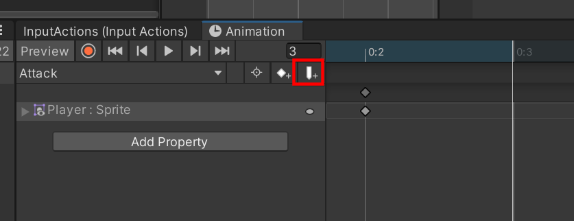

# Unity Learning - Input System

## Course Information

### Main Course Information

- Course: "The Ultimate Input System with Rebinding in Unity".
- Course link: https://www.udemy.com/course/unity-input-system-rebind/
- Repository: #TODO
- Course duration: 5 hour(s).
- Created by: Mario Korov - https://www.linkedin.com/in/mario-korov-ab9590202/
- Assets:
  - #TODO
- Slides
  - #TODO

### What we will learn in this course

https://docs.unity3d.com/Packages/com.unity.inputsystem@1.7/manual/Workflows.html

- Learn how to use the new Unity Input System workflows:
  - Directly Reading Device States.
  - Using Embedded Actions.
  - Using an Actions Asset.
  - Using an Actions Asset and a PlayerInput component.

## My goals

- Planned course range: 2024-07-04 - 2024-07-06 = 3 day(s) and 4.5 hour(s) of course.
- Actual course range: 2024-07-04 - #TODO = #TODO day(s)
- Learning goal: #TODO

## Tasks

### TODO list

- #TODO

## Gogot vs Unity

- (Plus to Unity) Unity has possibility to attach several scripts to the one object.

## Unity Guidelines from the Course

- Use `OnEnable`, `OnDisable` and `OnDestroy` to enable and disable the input actions.
  - It may be useful to implement menus and pause the game.

## Unity Recipes from the Course

### Import the Input System

- `Window -> Package Manager -> Input System -> Install`.
- `Edit -> Project Settings -> Player -> Other Settings -> Active Input Handling -> Input System Package (New) or Both`.

### Workflow 1: Directly Reading Device States

- https://docs.unity3d.com/Packages/com.unity.inputsystem@1.7/manual/Workflow-Direct.html
-
- Include `using UnityEngine.InputSystem;`.
- Use `Keyboard`, `Gamepad`, `Mouse` or `Touchscreen` classes.
- Use `Keyboard.current.wKey.isPressed` to check if the key is pressed.
- Use `Keyboard.current.wKey.wasPressedThisFrame` to check if the key was pressed this frame.
- Use `Keyboard.current.wKey.wasReleasedThisFrame` to check if the key was released this frame.

- `Edit -> Project Settings -> Input System Package -> Create Settings Asset` to create an input settings asset.

### Workflow 2: Using Embedded Actions

- https://docs.unity3d.com/Packages/com.unity.inputsystem@1.7/manual/Workflow-Embedded.html
- provides you with the flexibility to modify or add multiple bindings without needing to change your code.
  - `CallbackContext.performed` - is called when the action is performed.
  - `CallbackContext.canceled` - is called when the action is canceled.
  - `CallbackContext.started` - is called when the action is started.
- To read `Vector2` values
  - In Inspector, add a new binding to the action called `Add Up/Down/Left/Right Composite Binding`.
  - In the code, use `context.ReadValue<Vector2>()` to read the value.
- To read Gamestick values
  - In Inspector, add a new binding to the action called `Add Binding`.
  - In the code, use `context.ReadValue<Vector2>()` to read the value.
- Use `Add Positive/Negative Bundings` to support only one direction.
- `Edit -> Project Settings -> Input System Package -> Default Deadzone` to set the deadzone for the gamestick and even make it workable discrete like a keyboard.

```
using UnityEngine;
using UnityEngine.InputSystem;

public class ExampleScript : MonoBehaviour
{
    public InputAction move;
    public InputAction jump;
}
```


```csharp

public class EmbeddedActions : MonoBehaviour
{
    public InputAction jumpAction;

    void Start()
    {
        jumpAction.performed += OnPerformed;
        jumpAction.canceled += OnCanceled;
        jumpAction.started += OnStarted;
        jumpAction.Enable();
    }

    private void OnDisable()
    {
        jumpAction.performed -= OnPerformed;
        jumpAction.canceled -= OnCanceled;
        jumpAction.started -= OnStarted;
        jumpAction.Disable();
    }

    private void OnPerformed(InputAction.CallbackContext context)
    {
        bool value = context.ReadValueAsButton();
        Debug.Log("[EmbeddedActions.OnPerformed]: " + value);
    }

    private void OnCanceled(InputAction.CallbackContext context)
    {
        bool value = context.ReadValueAsButton();
        Debug.Log("[EmbeddedActions.OnCanceled]: " + value);
    }

    private void OnStarted(InputAction.CallbackContext context)
    {
        bool value = context.ReadValueAsButton();
        Debug.Log("[EmbeddedActions.OnStarted]: " + value);
    }

}

```

### Workflow 3: Using an Actions Asset

**Theory**

- https://docs.unity3d.com/Packages/com.unity.inputsystem@1.7/manual/Workflow-ActionsAsset.html
- Allows you to keep the data that defines your actions separate from the GameObjects.
- All your action definitions are stored as a single asset file.
- Ability to group actions into Action Maps and Control Schemes.
- Input Actions Asset window separate to four parts:
  - `Control Scheme` - a collection of action maps.
    - You might have one control scheme which is "Joypad", and
    - another control scheme which is "Keyboard and Mouse".
    - used to adapt the in-game UI to show the correct keys or buttons in on-screen prompts.
  - `Action Map` - a collection of actions.
    - each map relates to a different situation:
      - driving vehicles and
      - navigating on foot, and
      - may have in-game menus.
  - `Action` - a single action.
  - `Binding` - a single binding.
- There are **two distinct ways to access it from your code**. You can either:
  - Use an **inspector reference** to the Actions Asset.
    - You must read the actions by name using strings.
  - **Generate a C# class** that wraps your Actions Asset.
    - Unity generates an accompanying class as a new .cs script asset

**Practice**

- `Project -> Create -> Input Actions` to create an actions asset.
  - Call it `PlayerControls`.
  - Double click on it to open the asset.


- `Action Types` may be `Value`, `Button` or `Pass-Through`.
- `Control Type` may have a lot of options. Uses to filter the input.
  - Choose `Any` to accept any input. Then all types of bindings will be available:


- Moslty you may use `All Binding` to accept all types of bindings.

- Example of Positive/Negative Binding:


- Adding control scheme and setup the requirements:


- `Control Scheme` is useful when you will be implement the reseting of the bindings.

### Workflow 3: Using an Actions Asset Via Inspector Reference

- `[SerializeField] InputActionAsset inputActions;`
- Drag and drop the `PlayerControls` asset to the `inputActions` field.

```csharp

    [SerializeField] InputActionAsset actionAsset;

    InputAction jumpAction;
    InputAction moveAction;
    InputAction attackAction;
    InputActionMap playerNormalMap;

    private void Awake()
    {
        playerNormalMap = actionAsset.FindActionMap("PlayerNormal");
        jumpAction = playerNormalMap.FindAction("Jump");
        moveAction = playerNormalMap.FindAction("MoveHorizontal");
        attackAction = playerNormalMap.FindAction("Attack");
    }

```

- Use `OnEnable`, `OnDisable` and `OnDestroy` to enable and disable the input actions.
  - It may be useful to implement menus and pause the game.
- You may `Enable/Disable` whole `Asset`, `Action Map` or `Action`.

```csharp

    private void OnEnable()
    {
        actionAsset.Enable(); // Enable the entire asset
        // playerNormalMap.Enable(); // Enable individual maps
        // jumpAction.Enable(); // Enable individual actions
    }

```

- Use `moveAction.ReadValue<float>();` to read one demensional value.
- Use `moveAction.ReadValue<Vector2>();` to read two demensional value.
- Use `context.ReadValueAsButton();` to read the value as a button (bool) in callbacks.

```csharp

    private void OnEnable()
    {
        jumpAction.performed += JumpExample;
        jumpAction.canceled -= JumpStopExample;
        actionAsset.Enable();
    }

    private void OnDisable()
    {
        actionAsset.Disable();
        jumpAction.performed -= JumpExample;
        jumpAction.canceled -= JumpStopExample;
    }

    private void JumpExample(InputAction.CallbackContext context)
    {
        Debug.Log("Jumping");
        // tryToJump = context.ReadValueAsButton();
        tryToJump = true;
    }

    private void JumpStopExample(InputAction.CallbackContext context)
    {
        Debug.Log("Jumping Stopped");
        tryToJump = false;
    }

```

### Workflow 3: Using an Actions Asset Via Generated C# Class

- `Project -> Create -> Input Actions` to create an actions asset and named `PlayerControls`.
- Select the `PlayerControls` asset and click on the `Generate C# Class` button in the inspector.
- Use this class in the code.

```csharp

    PlayerControls controls; // Generated class from the input system

    private void Awake()
    {
        controls = new PlayerControls();
    }

    private void OnEnable()
    {
        controls.PlayerNormal.Jump.performed += JumpExample;
        controls.PlayerNormal.Jump.canceled += JumpStopExample;

        controls.PlayerNormal.Enable();
    }

    private void OnDisable()
    {
        controls.PlayerNormal.Disable();

        controls.PlayerNormal.Jump.performed -= JumpExample;
        controls.PlayerNormal.Jump.canceled -= JumpStopExample;
    }

    private void Update()
    {
        valueX = controls.PlayerNormal.MoveHorizontal.ReadValue<float>();
        Debug.Log("Value X: " + valueX);
    }

    private void JumpExample(InputAction.CallbackContext context)
    {
        Debug.Log("Jumping");
        // tryToJump = context.ReadValueAsButton();
        tryToJump = true;
    }

    private void JumpStopExample(InputAction.CallbackContext context)
    {
        Debug.Log("Jumping Stopped");
        tryToJump = false;
    }

```

### Ground check via 2D Raycast

- Use `Physics2D.Raycast(position, direction, distance, layerMask);` to check the ground.

```csharp
RaycastHit2D hit = Physics2D.Raycast(leftPoint.position, Vector2.down, rayLength, detectLayer);
if (hit)
{
    Debug.Log("Grounded");
}
```

### Basic Animations

- Select the object in the hierarchy.
- Open the `Animation` window.
- Click `Play` to start the animation.

### Blend Tree and Jump Animation

- Remove `JumpUp` and `JumpDown` animations from the `Animator`.
- Create a new `Blend Tree` and add `JumpUp` and `JumpDown` animations. Name it `JumpBlendTree`.
- Double click on the `JumpBlendTree` to open it.
- Select parameters `SpeedY` in `JumpBlendTree -> Parameters`.
- Add `JumpUp` and `JumpDown` animations into `JumpBlendTree -> Motion`.


- For `Attack Animation` make sense to disable `Can Transition to Self` in the `Animator`.

### Call method at the end of the animation




